# CodetyHub

CodetyHub is a premium, personalized AI-assisted STEM learning platform featuring a Flutter mobile client app, a Python FastAPI Machine Learning microservice, and a Node.js API Gateway bridge.

---

## Demo Video

[](https://youtu.be/wYt1I34-Ygc)

Click the link above or click the badge to watch the walkthrough video of the platform showing all the main tabs, course player, gamification popups, and the student portfolio.

---

## Application Screenshots

Here is a preview of the CodetyHub application UI, showing the blackmorphism and slate design theme:

<p align="center">
  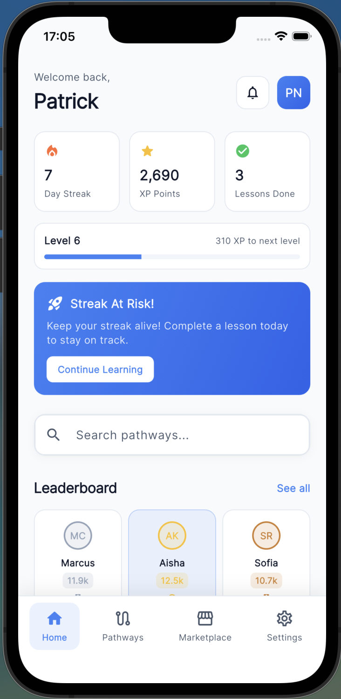
  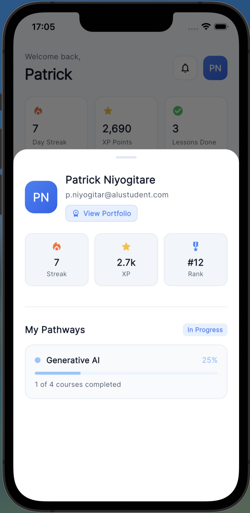
  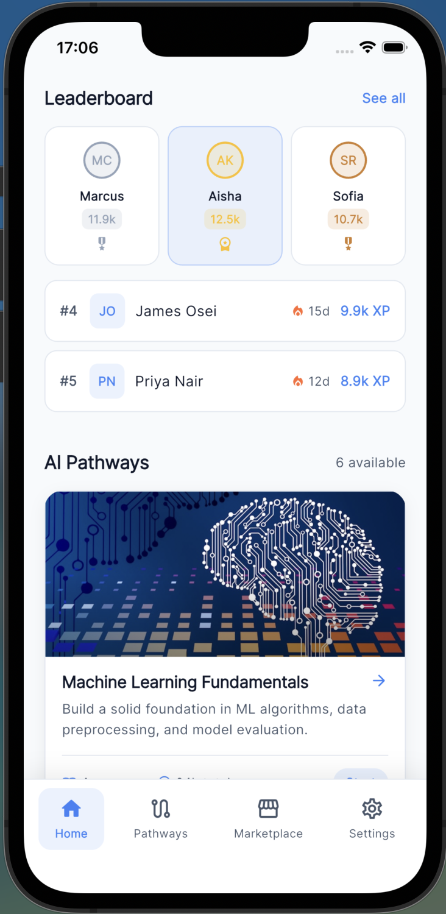
</p>

<p align="center">
  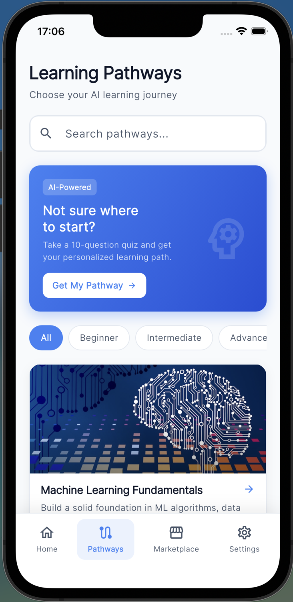
  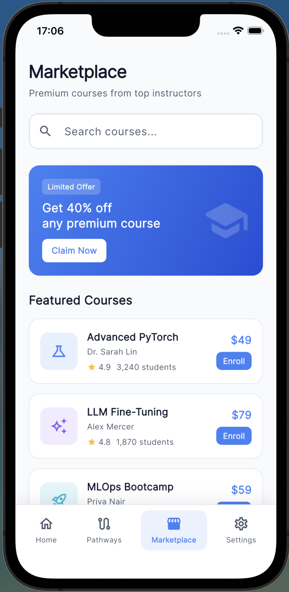
  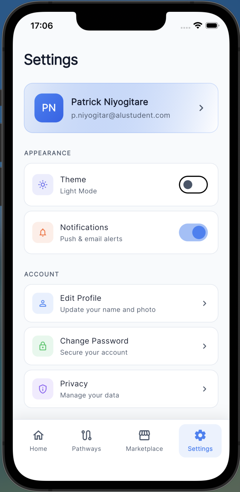
</p>

<p align="center">
  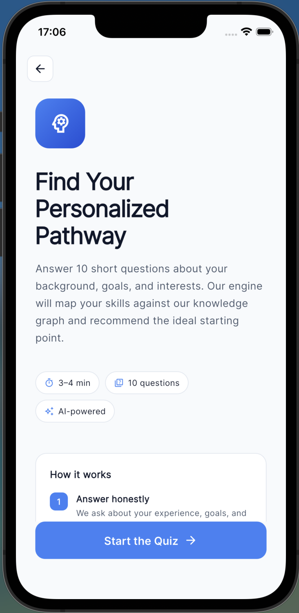
  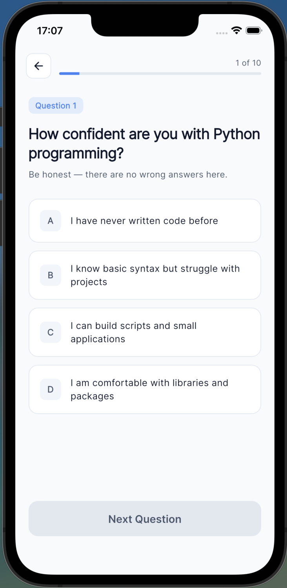
  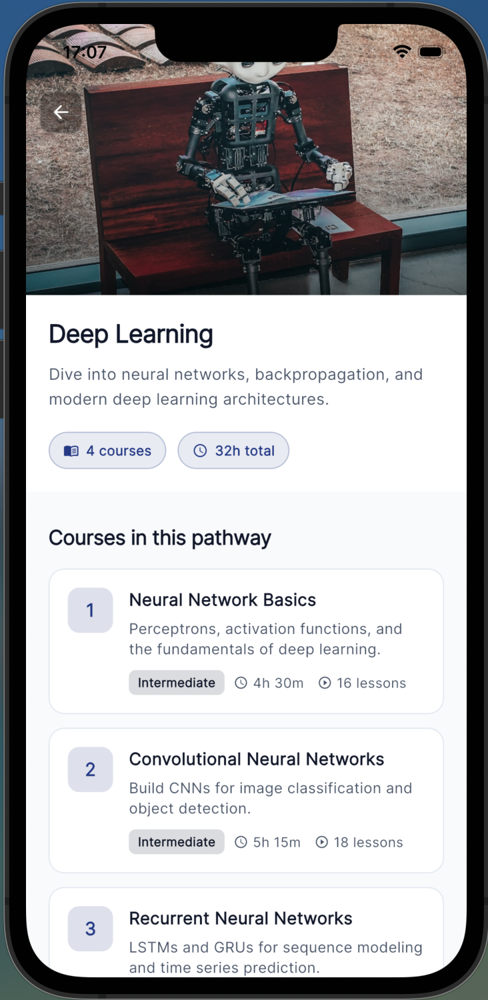
</p>

<p align="center">
  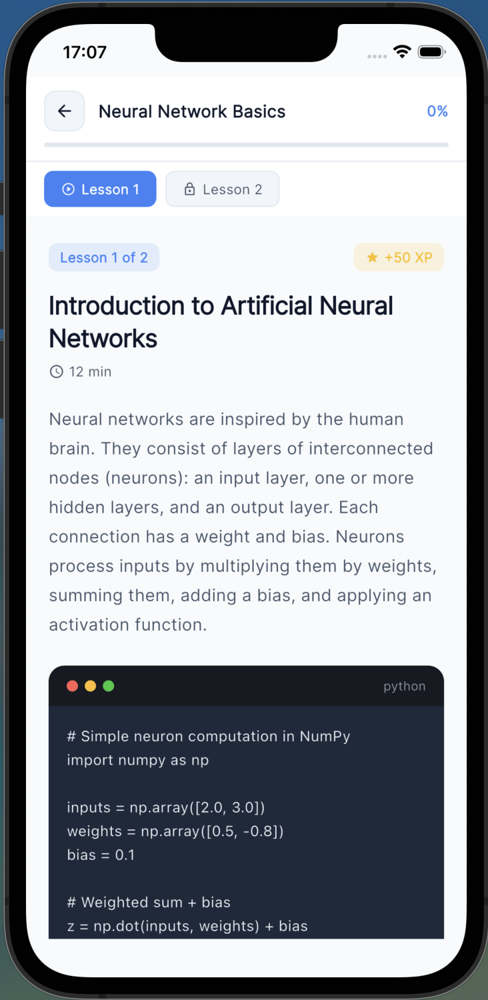
  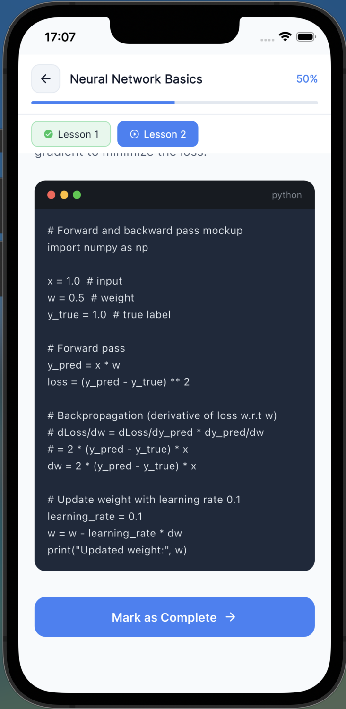
  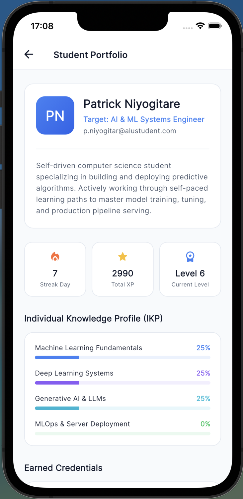
</p>

<p align="center">
  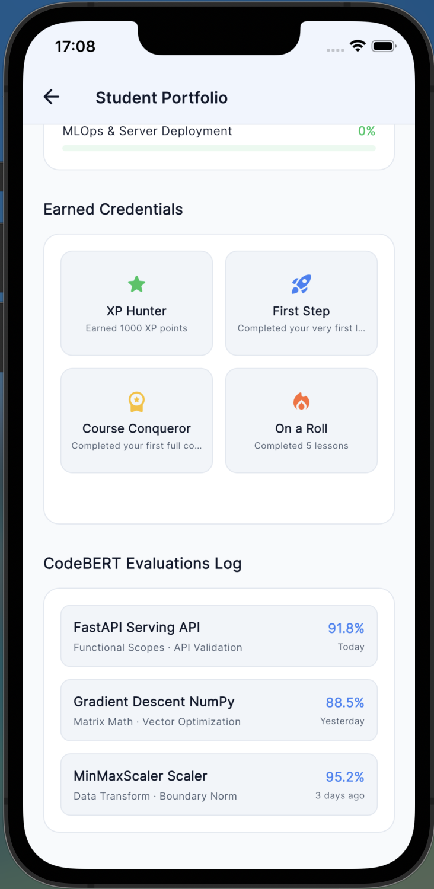
</p>

---

## System Architecture

CodetyHub is designed as a decoupled, multi-tier system that leverages a lightweight API gateway and a robust ML core service:

```
+-------------------------------------------------------------+
|                     Flutter Client (GetX)                   |
| - Theme Management (persisted via GetStorage)               |
| - Modular View Architecture (Home, Pathways, Settings, etc.)|
| - Gamification system + Local State tracking                |
+------------------------------|------------------------------+
                               | REST / HTTP Requests
                               v
+-------------------------------------------------------------+
|                Node.js Express API Gateway                  |
| - Morgan request logging middleware                         |
| - Authentication verification (JWT parsing stub)            |
| - Request parameter validation                              |
| - Proxying & Normalising communications to ML Service       |
+------------------------------|------------------------------+
                               | Internal REST / Proxied JSON
                               v
+-------------------------------------------------------------+
|             Python FastAPI ML Microservice                  |
| - Lifespan warm-up logic & CORS verification                |
| - Curriculum Prerequisite DAG builder (NetworkX)            |
| - User SVD Collaborative Filtering recommender (scikit-learn)|
| - Behavioural Student Dropout Risk predictor (XGBoost)       |
| - Verified Skill Score semantic evaluator (CodeBERT)        |
+-------------------------------------------------------------+
```

---

## Startup & Running Instructions

Follow these instructions to spin up all the services in your local development environment:

### Prerequisites
- Python 3.10+
- Node.js 18+
- Flutter SDK 3.10+

---

### 1. Python ML Microservice (`ML/`)
The ML microservice houses the curriculum Knowledge Graph DAG, SVD collaborative recommendation filter, XGBoost dropout risk predictor, and CodeBERT evaluation pipeline.

```bash
# 1. Set up and activate the virtual environment from the repository root:
python3 -m venv venv
source venv/bin/activate

# 2. Install Python dependencies:
pip install -r ML/requirements.txt

# 3. Start the FastAPI uvicorn server:
uvicorn ML.api.main:app --reload --port 8000
```
- **Local Endpoint:** `http://localhost:8000`
- **Swagger Documentation:** `http://localhost:8000/docs`

*(Optional) Train the XGBoost Dropout model manually:*
```bash
source venv/bin/activate
python -m ML.gamification.xgb_model_trainer
```

---

### 2. Node.js Express Bridge (`node-bridge/`)
Acts as the API gateway proxying requests from client applications, handling middleware validation, logging, and normalising backend errors.

```bash
# 1. Navigate to the bridge directory:
cd node-bridge

# 2. Install Node packages:
npm install

# 3. Copy the environment configuration:
cp .env.example .env

# 4. Start the dev server:
npm run dev
```
- **Local Dev Gateway:** `http://localhost:3001`
- **Proxy Endpoints:**
  - `POST /api/pathway/recommend` - Pathway SVD recommendations
  - `GET  /api/pathway/graph/info` - Graph properties
  - `GET  /api/pathway/graph/prerequisites/:skillId` - Topological sort lookup
  - `POST /api/gamification/risk` - Dropout risk predictor
  - `POST /api/code-review/evaluate` - CodeBERT scoring

---

### 3. Flutter Client App (`app/`)
The learning pathway companion client app featuring theme switches, gamification progress trackers, interactive course views, and portfolio pages.

```bash
# 1. Navigate to the app directory:
cd app

# 2. Retrieve Flutter packages:
flutter pub get

# 3. Run the application (select emulator/simulator or chrome):
flutter run
```

---

## System Verification

To execute the full automated end-to-end integration and API verification suite:
```bash
# From the repository root with virtual environment activated:
./venv/bin/python .gemini/antigravity/brain/1ce0d452-f35f-40dc-8f39-e8c785dba971/scratch/verify_system.py
```
This test harness starts both the FastAPI and Express bridge servers, executes API requests across all 12 system endpoints, asserts response schemas/status codes, and safely shuts down the processes.

---

## Author
**Patrick Niyogitare (p.niyogitar@alustudent.com)**

---

## License
This project is licensed under the **MIT License** 